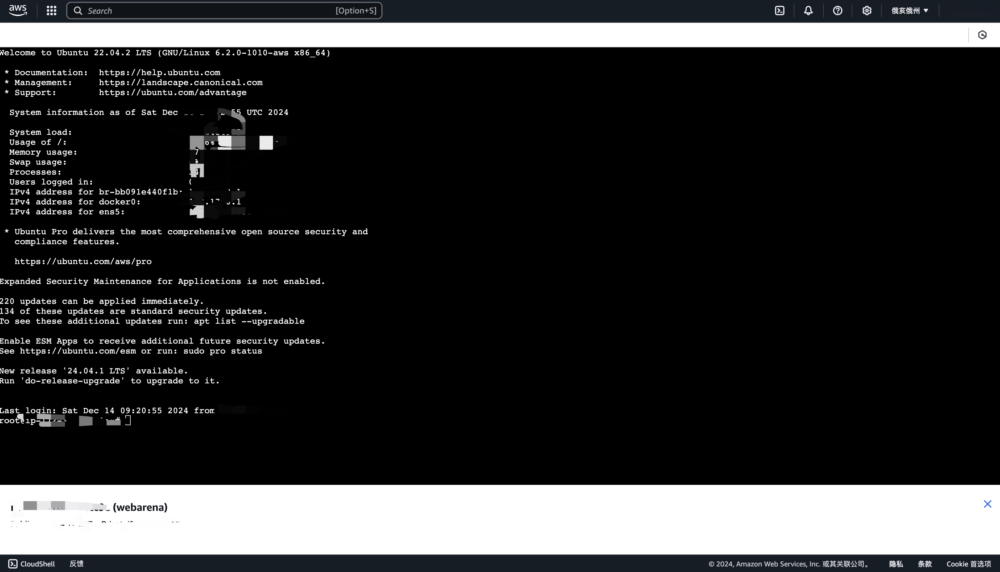

## 启动Amazon Machine assets/image实例Webarena

### 页面初始化（账号注册后的控制台主页信息）


### 控制界面详情
**安全组**: 配置入站/出站规则

**弹性IP**: 需要将建构好的实例与一弹性IP进行绑定

**密钥对**: 需要配置密钥对并下载密钥文件


### 步骤一：实例构建
```
AMI Information: find in console, EC2 - AMI Catalog
Region: us-east-2
Name: webarena
ID: ami-06290d70feea35450
```
需要在检索框中查询社区发布的AMI(webarena, ami-06290d70feea35450)，点击选择


接着根据要求确认实例类型为t3a.xlarge
```
1. Create an instance (recommended type: t3a.xlarge, 1000GB EBS root volume) from the webarena AMI. Use the security group just created and remember to select SSH key-pair.
```


```
2. Create a security group that allows all inbound traffic.
```


入站/出站规则基本一致，确保在IPv4版本下，**所有TCP**类型，开放全部端口，保证端口能够正常暴露.


完成后点击**启动实例**


新开界面设置弹性IP，后续将此IP与当前创建的实例进行绑定
```
3. Create an Elastic IP and bind to the instance to associate the instance with a static IP and hostname. Take note of the hostname, usually in the form of "ec2-xx-xx-xx-xx.us-east-2.compute.amazonaws.com". This will be used as "<your-server-hostname>" in the following commands.
```


### 步骤二：连接实例


看到这个界面就说明已经连接成功

### 步骤三：启动镜像
```bash
docker exec shopping /var/www/magento2/bin/magento setup:store-config:set --base-url="http://<your-server-hostname>:7770" # no trailing /
docker exec shopping mysql -u magentouser -pMyPassword magentodb -e  'UPDATE core_config_data SET value="http://<your-server-hostname>:7770/" WHERE path = "web/secure/base_url";'
# remove the requirement to reset password
docker exec shopping_admin php /var/www/magento2/bin/magento config:set admin/security/password_is_forced 0
docker exec shopping_admin php /var/www/magento2/bin/magento config:set admin/security/password_lifetime 0
docker exec shopping /var/www/magento2/bin/magento cache:flush

docker exec shopping_admin /var/www/magento2/bin/magento setup:store-config:set --base-url="http://<your-server-hostname>:7780"
docker exec shopping_admin mysql -u magentouser -pMyPassword magentodb -e  'UPDATE core_config_data SET value="http://<your-server-hostname>:7780/" WHERE path = "web/secure/base_url";'
docker exec shopping_admin /var/www/magento2/bin/magento cache:flush

docker exec gitlab sed -i "s|^external_url.*|external_url 'http://<your-server-hostname>:8023'|" /etc/gitlab/gitlab.rb
docker exec gitlab gitlab-ctl reconfigure
```

测试端口是否暴露正常，打开**http://\<your-server-hostname\>:7770**，出现以下界面，说明端口暴露正常，至此完成webarena镜像启动全部流程
